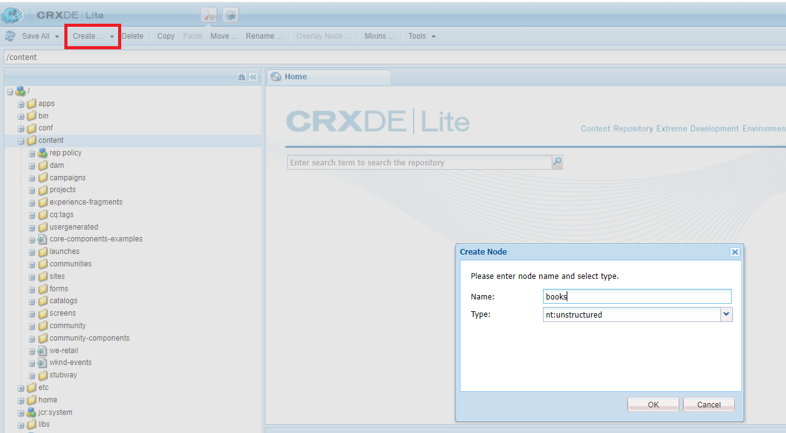
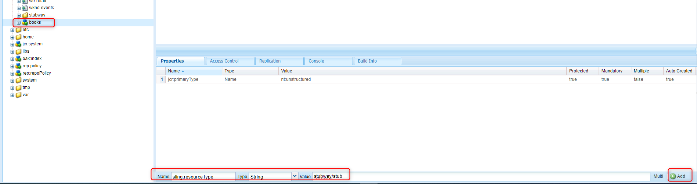
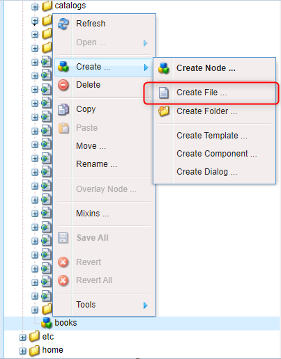
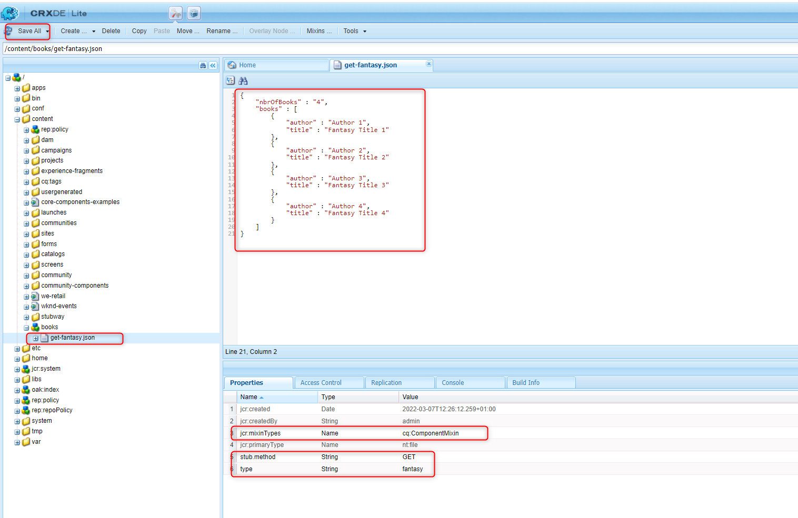
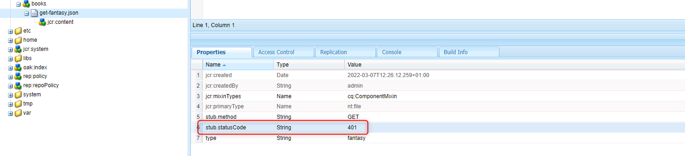

[](https://www.wundermanthompson.com/service/technology)

# Stubway

Simple, easy-to-use and fast way to make tests stable.

### What is Stubway?

Stubway allows less code-oriented people to easily create and maintain stubs for a specific request and response.

Stubway is a dependency free tool (Java code only) for AEM, used on platforms which restrict third party libraries and 
frameworks. This also makes Stubway easy to maintain and develop for anyone familiar with Java language.

### How to use?
To use Stubway: 
* Install Stubway package on your AEM author and/or publish instance
* To get example stubs, install stubway.ui.content-<version>.zip 
* Start creating your own stubs!

#### How to create stub for GET REST returning 200 OK and json? 

To create GET REST response for request sent to http://localhost:4503/content/books
with one query parameter `type=fantasy` (http://localhost:4503/content/books?type=fantasy), you need to perform 
the following steps:

**Step 1.** Go to CRXDE Lite http://localhost:4503/crx/de (NOTE: stubway is not accessible through /siteadmin view)

**Step 2.** Under `/content` create new node `books` (this name is important - it matches the path at REST endpoint) 
and choose `nt:unstructured` in Type field.



**Step 3.** Add property `sling:resourceType` with value `stubway/stub` for `/content/books` node:
 


**Step 4.** Under `/content/books` node create new file `get-fantasy.json` (file name is irrelevant)



**Step 5.** Click on `get-fantasy.json` and put content of json file. This will be the GET REST response. 

```json
{
    "nbrOfBooks" : "4",
    "books" : [
        {
            "author" : "Author 1",
            "title" : "Fantasy Title 1"
        },
        {
            "author" : "Author 2",
            "title" : "Fantasy Title 2"
        },
        {
            "author" : "Author 3",
            "title" : "Fantasy Title 3"
        },
        {
            "author" : "Author 4",
            "title" : "Fantasy Title 4"
        }
    ]
}
```

Add the following properties: 

`jcr:mixinTypes` type: Name, value: cq:ComponentMixin

`stub.method` type: String, value: GET <-- this property indicates the method of REST request. It can have the following
values: GET, POST (coming more in future).

`type` type: String, value: fantasy <-- this property matches the query parameter `type`. `fantasy` value will match 
`?type=fantasy` requests



Save the changes.

**Step 6.** Test your new stub. 

In REST client (i.e. Postman), run GET request: http://localhost:4503/content/stubway/stubs/library/books?type=fantasy

You should receive json response as it was configured in previous step: 

#### How to create stub returning different HTTP Status Code?

You can create stubs returning any HTTP Status Code (https://restfulapi.net/http-status-codes/)
`stub.statusCode` property with proper value in the file node. For example, if you want your stub to return 
401 (Unauthorized):




#### More examples? 

Find more examples under `/content/stubway` (provided in stubway.ui.content-<version>.zip package).

#### Prerequisites

Before you start creating your own stubs, make sure that you have:
* Java 8 or higher installed,
* Maven installed,
* AEM 6.4.X or higher up and running.

#### Installation

Go to the project root directory and run the following command with Maven 3:

    mvn clean install

When AEM instance is up, build and deploy the whole package using the following command:

    mvn clean install -PautoInstallSinglePackage

To deploy it to a publish instance, run:

    mvn clean install -PautoInstallSinglePackagePublish

Alternatively run:

    mvn clean install -PautoInstallSinglePackage -Daem.port=4503

The maven execution should complete with success status, listing all the deployed bundles:

```
[INFO] ------------------------------------------------------------------------
[INFO] Reactor Summary for Stubway 1.0.0:
[INFO]
[INFO] Stubway ............................................ SUCCESS [  0.355 s]
[INFO] Stubway - Core ..................................... SUCCESS [  3.224 s]
[INFO] Stubway - UI apps .................................. SUCCESS [  0.716 s]
[INFO] Stubway - UI content ............................... SUCCESS [  0.594 s]
[INFO] Stubway - All ...................................... SUCCESS [  0.316 s]
[INFO] ------------------------------------------------------------------------
[INFO] BUILD SUCCESS
[INFO] ------------------------------------------------------------------------
```

To deploy only one of those bundles to the author instance, go the respective folder and run:

    mvn clean install -PautoInstallBundle
    
### Testing 

Go to ["how to test"](stubway.tests/README.md) documentation.

## Support

Do you have any questions? Have you found a bug? 

Raise it using a proper [issue template](/.github/ISSUE_TEMPLATE.md). We will do our best to get back with a quick 
reply.

Do you want to contribute? 

That's amazing! See our [Contributing](/CONTRIBUTING.md) guide to get started.


## License

Stubway project is licensed under the terms of the [Apache 2.0 license](LICENSE.md).